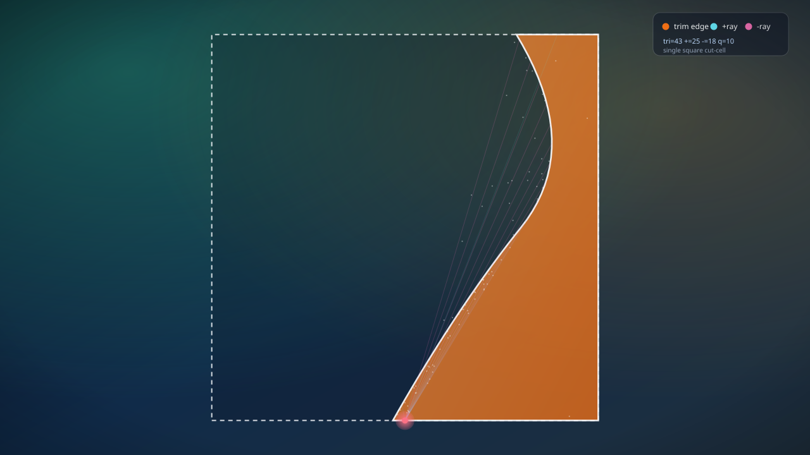
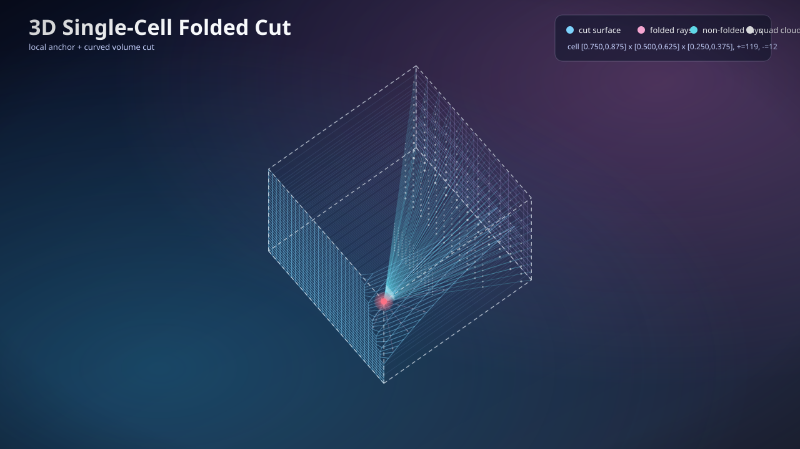

# CUTKIT

**CAD-native cut-cell integration for trimmed domains.**

CUTKIT helps you move from trimmed geometry to solver-ready integration data
without giving up topology correctness, reproducibility, or practical workflow
speed.

It is built for computational scientists and solver engineers who need:

- exact-enough geometry handling with clear failure semantics,
- folded decomposition workflows for trimmed cells,
- and clean handoff to downstream potential/solver stacks.

| 2D folded decomposition | 3D folded decomposition |
| --- | --- |
|  |  |

## Why teams choose CUTKIT

- **CAD first, not CAD last.** Use OpenCascade-backed clipping and folded
  integration when available.
- **No triangulation required for folded 3D.** Run folded boundary-face
  quadrature on clipped solids directly.
- **Production-friendly status model.** Batch operations return explicit
  per-box states (`ok`, `empty`, `invalid_box`, `backend_error`).
- **Solver handoff ready.** Export far/near primitives aligned with
  volumential-style workflows.
- **Reproducible research loop.** Scripted Antolin-Wei-Buffa Section 6
  reproductions with parity fixtures and CI checks.

## What you can do right now

### 2D trimmed workflows

- CAD-native clipping and integration (OpenCascade), plus polygonized fallback.
- Loop orientation normalization, cut-panel classification, and topology
  diagnostics.

### 3D folded workflows (no triangulation)

- CAD solid ingestion and axis-aligned clipping adapters.
- Folded boundary-face quadrature on clipped solids.
- Topology-first boundary validation for volumetric semantics.

### Solver-oriented exports

- Signed far-field source clouds (`coords`, `weights`, `charges`, ptr/index
  metadata).
- Near-field local operators (`assembled` CSR or `matrix_free` descriptor).
- List plumbing helpers for restricted-source
  `self/list1/list3/list4` workflows.

## Latest updates on `main`

- 3D clip/integration and source-cloud batch paths enforce boundary validation
  by default.
- Folded 3D quadrature rejects non-volumetric topology and non-finite explicit
  seeds early.
- Section 6.1.3 boundary knobs (`surface_resolution`, `side_resolution`) now
  actively drive folded surface sampling.
- Quick polygonized parity fixture refreshed to match validated metrics.

## Get started (2 minutes)

CUTKIT uses `uv` for dependency and environment management.

```bash
uv sync --extra dev
```

Optional extras:

```bash
uv sync --extra perf   # NumPy acceleration for faster eval/repro runs
uv sync --extra cad    # OpenCascade CAD-native workflows
```

Run the full local quality gate:

```bash
make dev
```

This runs format, lint, type-check, architecture checks, docs freshness,
tests, and cut-panel evaluation.

## Reproduce Antolin-Wei-Buffa Section 6

Run 2D + 3D quick protocols:

```bash
uv run python scripts/reproduce_antolin_2022_examples.py
```

Useful variants:

```bash
uv run python scripts/reproduce_antolin_2022_examples.py --skip-3d
uv run python scripts/reproduce_antolin_2022_examples.py --geometry-mode cad-native
uv run python scripts/reproduce_antolin_2022_examples.py --geometry-mode polygonized
uv run python scripts/reproduce_antolin_2022_examples.py --antolin-paper
```

Refresh a parity fixture:

```bash
uv run python scripts/reproduce_antolin_2022_examples.py \
  --geometry-mode polygonized \
  --parity-fixture tests/fixtures/antolin-section6/quick-polygonized-full.json \
  --write-parity-fixture
```

More fixture workflow details: `docs/antolin-parity-fixtures.md`.

## Consumer CAD interface example

```python
from cutkit.cad import CadSession

cad = CadSession.opencascade()
solid = cad.load_solid("example-solid.brep")

batch = solid.integrate_over_boxes(
    integrand=lambda x, y, z: 1.0,
    order=5,
    x0=[0.0, 0.5],
    x1=[0.5, 1.0],
    y0=0.0,
    y1=1.0,
    z0=0.0,
    z1=1.0,
    strict=False,
)

print(batch.statuses)
print(batch.values)
```

API details and object-vs-array patterns:
`docs/cad-box-batch-interface.md`.

## Volumential handoff boundary

CUTKIT emits primitives; downstream systems compose interactions.

- Far-field signed source-cloud export.
- Near-field local operator export + restricted-source plumbing.

Contract and integration skeleton: `docs/volumential-handoff.md`.

## Benchmarks and figure generation

```bash
uv run python scripts/run_poisson_galerkin_benchmark.py --profile quick --backend-mode folded
uv run python scripts/plot_poisson_galerkin_benchmark.py --profile quick
uv run python scripts/plot_poisson_galerkin_figure_pack.py --profile quick
```

See `docs/poisson-galerkin-solver.md` and `docs/poisson-benchmarks.md`.

## Development workflow notes

- Python requirement: `>=3.12`.
- `make dev` installs local `prek` hooks.
- Local pre-push guard blocks direct pushes to `main`.

Cut-panel tooling:

```bash
uv run python scripts/run_cutpanel_eval.py
uv run python scripts/run_cutpanel_eval.py --artifact-dir .artifacts/cutpanel
uv run python scripts/minimize_cutpanel_fuzz_cases.py
uv run python scripts/generate_readme_cover_images.py
```

Corpus details: `docs/cutpanel-corpus.md`.

## OpenSpec workflow

- `/opsx-propose <idea>` or `/opsx:propose <idea>`
- `/opsx-apply <change>` or `/opsx:apply <change>`
- `/opsx-archive <change>` or `/opsx:archive <change>`

Setup details: `docs/openspec-setup.md`.

## Source and credit

Section 6 reproductions are based on:

- Pablo Antolin, Xiaodong Wei, Annalisa Buffa
- *Robust Numerical Integration on Curved Polyhedra Based on Folded
  Decompositions*
- Computer Methods in Applied Mechanics and Engineering (2022)
- DOI: `10.1016/j.cma.2022.114948`
- arXiv: `2109.03734` (`https://arxiv.org/abs/2109.03734`)

## Repository map

- `AGENTS.md`
- `docs/index.md`
- `ARCHITECTURE.md`

## License

MIT. See `LICENSE`.
